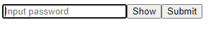

# React mobile style password field

Password field with fading letters during input.

 

## Installation

```sh
$ npm install react-mobile-style-password-input
```

## Usage

```js
import InputPassword from 'react-mobile-style-password-input';
```

```js
<InputPassword
    onPasswordChange={handlePasswordChange}
    name='password'
    type='password'
    placeholder='Input password'
/>
```
You can use all native input element props in standard way, exclude change field methods. Use `onPasswordChange` to get value. 

### Style component
You can style the component with usual way, wia `className` or `style` props.

## Options
You can use all native input element props in standard way, but be aware of some changes below. All props are not required. 

| Option        | Type      | Default value | Description                                                   |
|---------------|-----------|---------------|---------------------------------------------------------------|
| `onChange`| function  | | A callback function to be invoked when the `value` of the field changes. Receives an argument containing the React `SyntheticEvent` object, but has an patterned string (not real password value). Use `onPasswordChange` instead |
| `onPasswordChange`| function  | | A callback function to be invoked when the `value` of the field changes. Receives an value of password input (string). |
| `pattern`          | string    |'•' | The letter which will be used for hiding password letters.          |
| `nameSuffix`          | string    |'__masked' | Needs for generate masked (visible) password field `name` (value will be like `name` + `nameSuffix`)          |
| `inputRef`          | React.RefObject<HTMLInputElement>    | new React.RefObject<HTMLInputElement> | Ref for masked (visible) password input.          |
| `type`          | string    | 'password' | Native `type` of `HTMLInputElement` for real (hidden) password input. Most case is use 'password' and 'text'.         |
| `name`          | string    | 'password' | Native `name` of `HTMLInputElement` for real (hidden) password input. Used for generate masked (visible) input name.       |
| `autoComplete`          | boolean    | undefined | Native `autoComplete` of `HTMLInputElement` for both real (hidden) and masked (visible) password inputs.       |
| `letterFadeDuration`          | number    | 600 | Delay before hiding inputted letter (ms).       |

## Development and Demo

Install dependencies:

Fork the repo and then execute commands in the project folder:
```
$ npm install
$ npm run dev
```
Run the example page in your browser: `/example/public/index.html`

## License

MIT